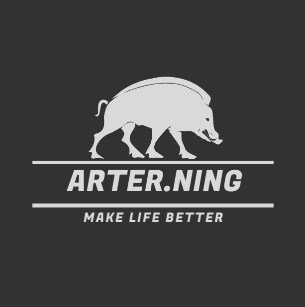

<p align="center">
  <a href="https://work.xiejiahe.com">
    
  </a>
  <br />
  <b>小慧牌个人事务管理系统</b>
  <p align="center">
    <a href="https://google.com">
      
    </a>
    
  </p>
</p>


## Built with
- [Hooks](https://zh-hans.reactjs.org/docs/hooks-intro.html)
- [TypeScript](https://www.typescriptlang.org/)
- [Redux](https://redux.js.org/tutorials/fundamentals/part-5-ui-react)
- [Ant Design](https://ant.design/docs/react/introduce-cn)
- [Vite](https://vitejs.dev)


## Build Setup
- Node.js >= 14

``` bash

# install dependencies
npm i

# serve with hot reload at localhost:7000
# user: test, password: 123456
npm start
npm run start:prod # Connect to production environment

# build for production with minification
npm run build
```


---

## License
[MIT](https://opensource.org/licenses/MIT)
